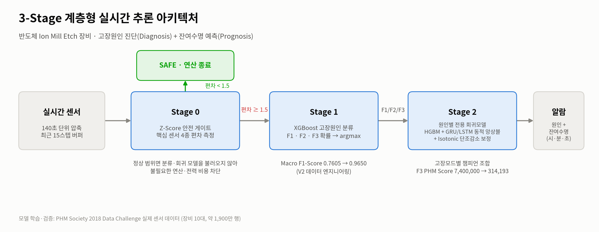
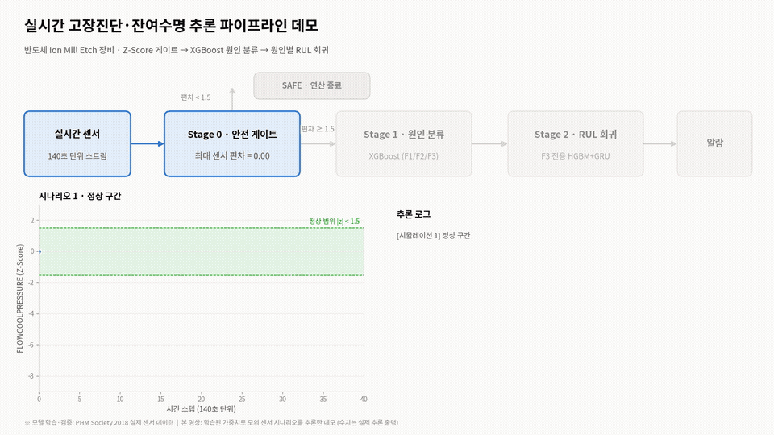

# PHM 2018 Ion Mill Etch — 3-Stage Fault Diagnosis & RUL Prediction System

**3-Stage predictive maintenance pipeline** for semiconductor ion mill etching equipment,
built on the **PHM Society 2018 Data Challenge** dataset.  
It answers two questions together: **when** the tool will fail (Remaining Useful Life, RUL)
and **why** it will fail (fault cause F1 / F2 / F3).

---

## 📌 Project Overview

The original PHM 2018 challenge asks only for the **time-to-failure (RUL)** of each fault mode.
From an operations point of view, an RUL without a cause is hard to act on — the maintenance
team still does not know which part to check.

This project therefore **redefines the task as "Diagnosis + Prognosis"** and builds a 3-stage
inference system:

- **Stage 0 — Z-Score safety gate**: skips all heavy models while the tool is healthy (cuts compute and power cost)
- **Stage 1 — Fault-cause classifier**: XGBoost identifies which of the 3 fault modes is developing
- **Stage 2 — Fault-specific RUL regressor**: HGBM + GRU/LSTM dynamic ensemble with isotonic (monotonic) correction

Personal project carried out in the campus AI club **Aing** (SeoulTech). All data engineering,
modeling, and system design were done by the author.

---

## 🎯 Objectives

- Predict RUL for 3 Flowcool fault modes from ~19M rows of multivariate sensor time series (10 tools)
- Keep predictions physically consistent (RUL must not increase over time)
- Identify the fault cause so that the alarm is actionable
- Avoid running expensive models when the equipment is in a normal state
- Export trained weights and run inference **without retraining**

---

## ⚙️ System Architecture



```
Real-time sensor stream (140 s bins, last 15 steps buffered)
        ↓
[Stage 0] Z-Score safety gate  ── max |z| of 4 core sensors < 1.5 ──▶ SAFE (no model call)
        ↓ (≥ 1.5)
[Stage 1] XGBoost fault classifier → P(F1), P(F2), P(F3) → argmax
        ↓
[Stage 2] Fault-specific regressor (dictionary routing)
          HGBM + GRU/LSTM dynamic ensemble, per-mode MAX_TTF
        ↓
Alarm: fault cause + RUL (h / m / s)
```

- Core sensors for the gate: `FLOWCOOLPRESSURE`, `IONGAUGEPRESSURE`, `ETCHBEAMCURRENT`, `FLOWCOOLFLOWRATE`
- Dynamic ensemble weight: `α = clip((MAX_TTF − DL_pred) / (0.8 · MAX_TTF), 0.1, 0.9)`,
  `RUL = α·DL + (1 − α)·HGBM` → tree model leads when RUL is long, sequence model leads near failure

---

## 🛠️ Techniques Used

### **Data Processing**
- Idle-state removal (`FIXTURESHUTTERPOSITION == 1` only)
- Episode split: a new failure cycle starts when TTF resets or the unit changes
- Time-bin downsampling (swept 32 → 60 → 80 → 100 → 120 → **140 s**) to suppress 4 s high-frequency noise
- **Unit-Aware Scaling**: an independent `StandardScaler` per tool (sensor baselines differ by unit)
- Target shaping: **MAX_TTF capping** (50,000 s → tuned to 14,000–15,000 s) + `log1p` / `expm1`
- Validation: the **last failure cycle of each unit** is held out (no random split)

### **Feature Engineering**
- Rolling window statistics per core sensor: mean, std, max, RMS, skewness, kurtosis
- Mechanical condition indicators: peak / waveform (shape) / pulse (impulse) / margin (clearance) factor
- Trend features (V7.1~): diff, pct_change, deviation from rolling mean, EMA, smoothed diff

### **Models**
- **Regression**: `HistGradientBoostingRegressor` + stacked LSTM / GRU (64 → 32 units, seq_len = 15)
- **Post-processing**: `IsotonicRegression(increasing=False)` per episode — enforces monotonic RUL decrease
- **Classification**: `XGBClassifier (multi:softprob)` for fault cause, RandomForest + SMOTE for L/H risk
- **Imbalance handling**: SMOTE / Multi-Class SMOTE, RandomUnderSampler

### **Evaluation Metrics**
- **PHM Score** (official, asymmetric; late predictions are penalized exponentially, lower is better)  
  `Score = Σ exp(−0.001 · y_true) · |y_true − y_pred|`
- RMSE, MAE (seconds)
- Macro F1-Score (fault cause)

---

## 📂 Dataset

- **Source**: [PHM Society 2018 Data Challenge](https://phmsociety.org/wp-content/uploads/2018/05/PHM-Data-Challenge-2018-vFinal-v2_0.pdf) — Ion Mill Etching System
- **Scale**: 10 tools (`01_M01` ~ `10_M01`), ~19M rows, 24 variables (sensors, recipe/stage, usage counters)
- **Targets** (time-to-failure in seconds)

| Code | Fault mode | Characteristic |
|------|------------|----------------|
| **F1** | Flowcool Pressure Too High (Check Flowcool Pump) | gradual rise, abrupt shutdown |
| **F2** | Flowcool Leak | subtle loss of correlation between sensors |
| **F3** | Flowcool Pressure Dropped Below Limit | sudden drop, hardest to predict |

- **Two dataset tracks** (same raw data, different inputs)

| | Classifier (V2) | Regressor (V1) |
|---|---|---|
| Question | "Which fault?" | "When does it stop?" |
| Aging counters (`runnum`, `ETCHSOURCEUSAGE`, …) | **kept** | **removed** (prevents memorizing "high run count → short life") |
| Process context (`recipe`, `stage`) | kept (OrdinalEncoder) | kept |
| Series ID | Unit + Lot (e.g. `01_M01_Lot1`) | Unit + TTF reset |

> Raw data is not included in this repository. Scripts expect per-unit labeled CSVs
> (`XX_M01_labeled_Final.csv`, sensor data + `TTF_*` columns) and the merged masters
> `ALL_M01_MASTER_labeled.csv` (regression) / `ALL_M01_MASTER_labeled_V2.csv` (classifier) on Google Drive.

---

## 🔍 EDA Highlights

- TTF distribution is heavily **right-skewed** (0 ~ tens of millions of seconds) → capping + log transform
- Life scale differs by **30×+** between tools (e.g. F3 mean ≈ 0.33M s on 09_M01 vs ≈ 10M s on 06_M01) → per-unit scaling
- `03_M01` has no leak (F2) record → rows without a target are dropped per fault mode
- Several cycles are **right-censored** (preventive maintenance before failure) → kept, since the degradation trend is still informative

---

## 🚧 Challenges & Improvements

### 1. Choosing the right optimization target (V7.1)
- An AI-generated sweep script ranked settings by PHM Score only and picked
  **100 s / 18,000 s / LSTM** as #1.
- That model had **RMSE 4,133** — it defends the penalty by predicting conservatively everywhere,
  which makes the day-to-day RUL unstable for operators.
- **Rejected** it and re-selected on the **RMSE · MAE · PHM Score balance** → **140 s / 15,000 s / HGBM + GRU**.

### 2. Classifier plateau at Macro F1 0.76
Traced the AI-generated preprocessing code line by line and found three structural causes:
1. **Aging counters deleted** (`runnum` etc.) to save memory → no way to tell "new-machine noise" from "fault sign"
2. **Process context dropped** by `ColumnTransformer(remainder='drop')` → `recipe`/`stage` silently lost
3. **Lot-agnostic split** → past and future of the same maintenance cycle mixed (**data leakage**)

Fixes (V2 data engineering): chunked loading + 140 s compression (keeps counters within memory),
OrdinalEncoder for process context, Unit + Lot episode separation, per-unit scaling.

### 3. Physically inconsistent predictions
- Deep models occasionally predicted RUL **increasing** over time → per-episode isotonic regression (monotonic decrease)

### 4. Cross-target leakage (V8)
- When extending to F1/F2, other fault modes' `TTF_*` columns were excluded from the inputs.

### 5. Operating cost
- Running every model on every sample wastes compute while the tool is healthy
  → Z-Score gate calls the classifier/regressors only when a core sensor deviates (|z| ≥ 1.5).

---

## 📊 Results

> Self-built validation set (last failure cycle of each unit). Not comparable to the official leaderboard.

### RUL regression — F3 (Pressure Dropped Below Limit)

| Step | RMSE | PHM Score |
|------|------|-----------|
| Raw data | 5,000+ | 7,400,000 |
| + Feature engineering | 2,500 | 1,800,000 |
| + 80 s downsampling | 1,603 | 584,716 |
| + 100 s downsampling | 816 | 481,092 |
| **+ 140 s downsampling (final)** | **1,008** (MAE 740) | **314,193** |

→ **PHM Score −96%** (7,400,000 → 314,193). The 100 s step has the lowest RMSE but a higher
penalty; 140 s was chosen for the overall balance.

### Champion regressor per fault mode

| Fault | Downsample | MAX_TTF | Model | PHM Score |
|-------|-----------|---------|-------|-----------|
| F1 Pressure Too High | 140 s | 14,000 s | HGBM + GRU | 306,150 |
| F2 Leak | 140 s | 14,000 s | HGBM + LSTM | 72,668 |
| F3 Pressure Drop | 140 s | 15,000 s | HGBM + GRU | 314,193 |

### Fault-cause classifier (XGBoost, Macro F1)

| Danger label (H) | Before (V1 data) | After (V2 data) |
|------------------|------------------|-----------------|
| **TTF ≤ 14,000 s (selected)** | 0.7605 | **0.9650** |
| TTF ≤ 10,000 s | 0.6685 | 0.9343 |
| TTF ≤ 5,000 s | 0.6045 | 0.9681 |

- 5,000 s is marginally higher on cause F1 alone, but 14,000 s wins on the total score
  (L/H F1 + cause F1) and matches the regressor's MAX_TTF.
- Exported champion (retrained with Multi-Class SMOTE): validation Macro F1 **0.9579**.

### End-to-end inference check (mock sensor scenarios)



| Scenario | Stage 0 max deviation | Output |
|----------|----------------------|--------|
| Normal | 0.32 | SAFE — classifier/regressors not called |
| F3-like pressure drop | 8.10 | P(F1, F2, F3) = 0.126 / 0.025 / **0.850** → F3 regressor → RUL ≈ 2 h 2 m 49 s |

Models are trained and validated on the real PHM 2018 data; the scenarios above only feed
synthetic Z-scaled inputs to verify that the full 3-stage flow runs with the saved weights.

---

## 🤖 AI-Assisted Development

ChatGPT and Gemini were used as coding partners to draft preprocessing, model, and sweep code
(V6 → V8). Every output was checked against the numbers and the physics before adoption:

| AI output | What was changed |
|-----------|------------------|
| Sweep ranked by PHM Score only | Rejected the #1 model (RMSE 4,133), re-selected on RMSE·MAE·PHM balance |
| Preprocessing that deleted counters / dropped context / split randomly | Diagnosed 3 causes of the 0.76 plateau, rebuilt V2 data → 0.965 |
| Raw DL predictions with RUL rebounds | Added isotonic monotonic correction |
| Run-every-model inference | Added Z-Score gate for operating cost |

---

## 🗂 Repository Structure

```
src/
├── 01_rul_regression/
│   ├── v6_baseline_single_unit.py       # HGBM + LSTM baseline on 01_M01, capping, isotonic
│   ├── v7_global_downsampling.py        # all 10 units, downsampling, unit-aware scaling
│   ├── v7_1_param_sweep_f3.py           # downsample × MAX_TTF × LSTM/GRU sweep (F3)
│   └── v8_multi_fault_sweep_f1_f2.py    # same pipeline for F1 / F2, TTF leakage guard
├── 02_fault_classifier/
│   ├── build_v2_dataset.py              # V2 master CSV (aging counters + Unit_Lot IDs)
│   ├── classifier_threshold_search.py   # H-label threshold search (5k / 10k / 14k s)
│   └── train_save_classifier.py         # final XGBoost + SMOTE, export weights
└── 03_inference_pipeline/
    ├── train_save_regressors_f1_f2.py   # export F1 / F2 champion regressors
    ├── train_save_regressor_f3.py       # export F3 champion regressor
    └── inference_3stage.py              # Z-gate → classifier → routed RUL regressor
docs/
├── architecture.png
└── inference_demo.gif
```

---

## 🚀 How to Run

Environment: Google Colab (paths point to `/content/drive/MyDrive/`)

```bash
pip install pandas numpy scikit-learn tensorflow xgboost imbalanced-learn joblib
```

1. Place the labeled CSVs on Google Drive (see **Dataset**)
2. *(experiments)* Run `src/01_rul_regression/*` in order to reproduce V6 → V8 results
3. Run `src/02_fault_classifier/build_v2_dataset.py` → `train_save_classifier.py`
4. Run `src/03_inference_pipeline/train_save_regressors_f1_f2.py` and `train_save_regressor_f3.py`
   → weights are saved to `PdM_Models_Regression/`
5. Run `src/03_inference_pipeline/inference_3stage.py` → loads all weights and runs the 3-stage inference

---

## 🔑 Future Improvements

- Replace the fixed Z-Score threshold with a learned / per-unit gate and measure the skipped-compute ratio on real streams
- Fit isotonic correction online (causal) instead of per validation episode
- Validate on unseen tools (leave-one-unit-out) and against the official test set
- Serve the pipeline as an API with a model registry

---

## 📄 Documentation

Project story, EDA, experiment logs, and presentation slides are organized on Notion:

👉 https://www.notion.so/3e816f83064c81c29fb7e16d2f0f043f

---

## 👤 Author

- **Affiliation**: Seoul National University of Science and Technology (SeoulTech), AI club Aing
- **Role**: Problem definition, data engineering, RUL regression, fault classifier, 3-stage inference system (solo project)
